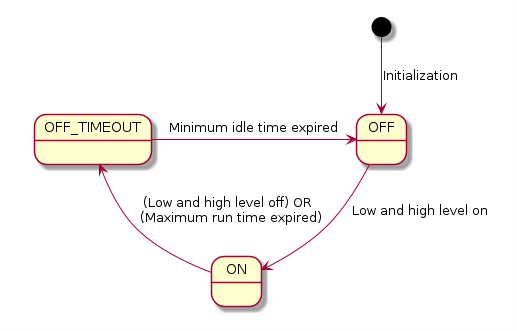

# Water Pump Controller
Controls the water pump to empty the air dehumidifier.

## Basic functionality ##
See state diagram in the doxygen documentation in class PumpController. Right below a screen-shot of the state diagram.

### State Description ###

State          | Description
-------------- | -----------
On 	           | Pump state is on, maximum run time timer is on.
Off 	       | Pump state is off, it is ready to switch on.
OffTimeout     | Pump state is off, the min idle timer is still running. The pump remains off independent of the level detection.

## Memory & stdio ##
There is not enough FLASH memory to link the stdio and use the printf("xx %d") function. Therefore the DebugWriter and the BCD_Time were introduced. Both are very simple & stupid implementation. They do not offer much functionality but just enough for the given project.

## Environment ##
The code runs on an STM23F030F4 with 16kBytes FLASH and 4 Bytes SRAM. The project uses the demo board (https://stm32-base.org/boards/STM32F030F4P6-STM32F030-DEMO-BOARD-V1.1) and some custom hardware to detect an upper and lower water level. The circuit detects the water levels depending on its electrical resistance. The pump is switched by a simple relay.

August 2020, reto271
